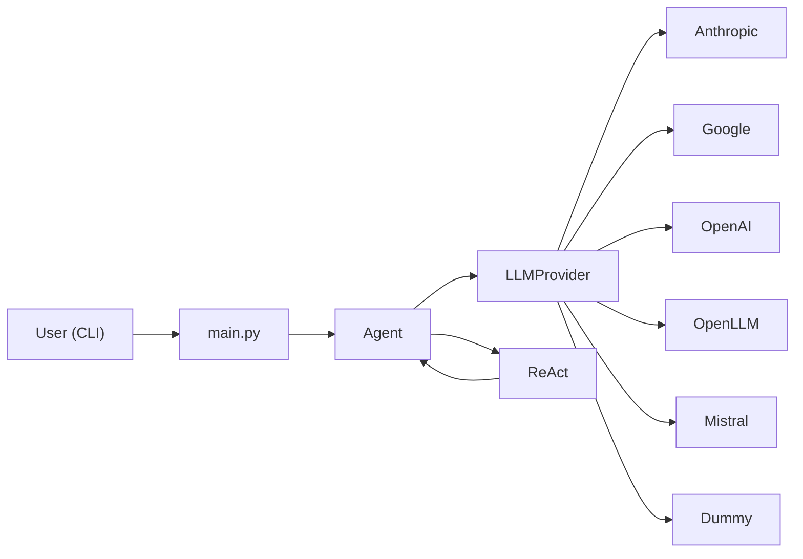

# Sunraise

A modular Python CLI for multi-turn conversations with LLM agents.

## What it does

- Runs an interactive chat loop from the terminal
- LLM Support -  **Anthropic**, **Google**, **OpenAI**, **Mistral**, and a **dummy** provider for local testing without API keys.
- Tool calling — built-in `get_weather` and `get_current_time` tools for all providers but dummy.
- ReAct loop — optional multi-step reason-act-observe loop (`--react`) for **Anthropic**, **Google**, **OpenAI**, and **Mistral**. The agent iteratively calls tools and feeds observations back until it produces a final answer or hits the step budget

## Project structure

```
sunraise/
├── src/
│   ├── agent.py                # Agent wrapper around an LLM provider
│   ├── banner.py               # Colored CLI startup banner
│   ├── config.py               # Provider config map, version, Google tool/system-instruction config
│   ├── conversation.py         # Helpers functions to pre-process and store conversation on disk
│   ├── llm.py                  # LLM Provider abstract class 
│   ├── provider_anthropic.py   # Provider implementations for Anthropic LLM
│   ├── provider_dummy.py       # Provider implementations for Dummy LLM
│   ├── provider_google.py      # Provider implementations for Google LLM
│   ├── provider_mistral.py     # Provider implementations for Mistral LLM
│   ├── provider_openai.py      # Provider implementations for OpenAI LLM
│   ├── provider_openllm.py     # Provider implementations for Google LLM
│   ├── main.py                 # CLI entry point (multi-turn chat)
│   ├── user.py                 # User identity model
│   └── tools/  
│       ├── weather.py          # get_weather tool + per-provider schemas
│       └── current_time.py     # get_current_time tool + per-provider schemas
└── requirements.txt
```

## Prerequisites

- Python 3.10+
- API keys for the providers you plan to use (not required for `--provider dummy`)

## Setup

1. Clone the repository and enter the project directory:

```bash
cd /sunraise
```

2. Create and activate a virtual or conda environment:

```bash
python -m venv .venv
source .venv/bin/activate
```
or
```bash
conda create -n sunraise python=3.10
conda activate sunraise
```

3. Install dependencies:

```bash
pip install -r requirements.txt
```

`requirements.txt` includes:
- all provider SDKs: `google-genai`, `anthropic`, `openai`, `mistralai`
- the dev tooling: `pre-commit`, `black`, `ruff`
- `tzdata` on Windows (needed by `get_current_time`'s `zoneinfo`)
- `python-dotenv`

4. IMPORTANT: Create a `.env` file in `src/` with your API keys and model names (see table below).

API keys are free for Google Gemini and Mistral AI:

- [https://aistudio.google.com/api-keys](https://aistudio.google.com/api-keys)
- [https://admin.mistral.ai/organization/api-keys](https://admin.mistral.ai/organization/api-keys)

### Environment variables

Add these to `src/.env` (only the variables for your chosen provider are required):


| Variable            | Description                                      |
| ------------------- | ------------------------------------------------ |
| `API_KEY_GEMINI`    | Google Gemini API key                            |
| `LLM_MODEL_GEMINI`  | Gemini model name (e.g. `gemini-flash-latest`)   |
| `API_KEY_CLAUDE`    | Anthropic API key                                |
| `LLM_MODEL_CLAUDE`  | Claude model name (e.g. `claude-opus-4-8`)       |
| `API_KEY_GPT`       | OpenAI API key                                   |
| `LLM_MODEL_GPT`     | OpenAI model name (e.g `gpt-5.5`)                |
| `API_KEY_MISTRAL`   | Mistral API key                                  |
| `LLM_MODEL_MISTRAL` | Mistral model name (e.g. `mistral-small-latest`) |
| `API_KEY_OPENLLM`   | OpenLLM API key                                  |
| `LLM_MODEL_OPENLLM` | OpenLLM name (e.g. `google/gemma-4-26b-a4b-qat`) for LM Studio |
| `BASE_URL_OPENLLM`  | OpenLLM url  (e.g. `http://127.0.0.1:1234/v1`) for LM Studio  |

Notice: 
- Without a `.env` file, only the **dummy** provider works.
- OpenLLM requires the extra BASE_URL_OPENLLM variable

## Usage

### Provider options


| Flag                   | Provider                              |
| ---------------------- | ------------------------------------- |
| `--provider dummy`     | Echoes your input (no API key needed) |
| `--provider anthropic` | Claude via Anthropic SDK              |
| `--provider google`    | Gemini via Google GenAI SDK           |
| `--provider openai`    | GPT via OpenAI SDK                    |
| `--provider openllm`   | OpenLLM via LM Studio, Ollama, vLLM   |
| `--provider mistral`   | Mistral via Mistral SDK               |


Example with a live provider:

```bash
cd /src
python main.py --provider google
```

During the session:

- Type your message at the `[user]:` prompt
- Read the agent reply at `[agent]:`
- End the session with `exit`, `quit`, or `/q`

### Tools / function calling

Sunraise ships with two built-in tools, implemented in `src/tools/`:

- `get_weather(city)` — returns the weather for a city
- `get_current_time(timezone)` — returns the current date and time for a timezone

Each provider expects its tools in a different shape, so every tool defines a per-provider schema:

- **Anthropic** uses a `block` definition
- **Google** uses a `part` definition and `config` helper
- **OpenAI** uses `item` definition
- **Mistral** uses `item` definition

At runtime, each provider in `src/llm.py` resolves a tool call.
The **dummy** provider has no tools.

### ReAct loop

By default, each provider does a single reason→tool→answer round-trip. 
Passing `--react N` enables a multi-step ReAct loop where the agent repeatedly:

1. Calls the model with the running conversation
2. Executes any requested tools (`get_weather`, `get_current_time`)
3. Appends the observations back into the conversation
4. Repeats until the model returns a final answer with no tool calls, or `N` steps are reached (a budget message is returned)

`N` must be one of `3`, `5`, `7`, `9`, `100`. Supported for `anthropic`, `google`, `openai`, `openllm`, `mistral`.

```bash
cd src/
python main.py --provider openai --react 3
```

### Architecture




- `**LLMProvider**` — abstract base class; each provider implements `__call__` with provider-specific message formatting
- `**Agent**` — holds a provider instance and delegates inference
- `**User**` — lightweight identity model (UUID per session)
- `**main.py**` — builds the conversation history, formats messages per provider, and persists on exit
- `**config.py**` - support modules for provider config
- `**banner.py**` —  version and the CLI startup banner
- `**tools**` — each provider routes tool calls through `tool_switch` to `get_weather` / `get_current_time` templates

## Development

- Pre-commit hooks are configured via `.pre-commit-config.yaml`

## License

See [LICENSE](LICENSE).